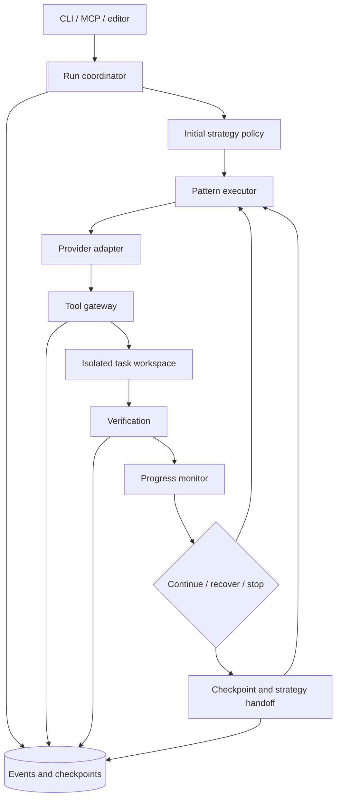

# Runtime architecture

Status: broader target design. Sequential, bounded Hierarchical, Docker checks, Search, opt-in fixed switching and stdio MCP prototypes exist; [runtime usage](runtime-usage.md), [Search/routing](search-and-routing.md) and [interfaces](interfaces.md) document their actual limits. Arbitrary work-unit graphs, learned routing, concurrent workers and broader sandbox platforms remain unimplemented. Live model/isolation and efficacy validation are pending.

## Control boundary

The core is an execution state machine. A model proposes plans and actions; the runtime validates transitions, dispatches work, mediates tools, and records outcomes. The runtime can enforce ordering, budgets, and capabilities inside its boundary. It cannot guarantee that a permitted action is correct.

Prefer a TypeScript core as an initial project choice, with a local CLI and future MCP/editor integration sharing types. Use SQLite for atomic state transitions plus append-only event rows; store large artifacts separately with content hashes. This choice is provisional until the first provider and sandbox are selected. A custom, small state machine makes dispatch guarantees inspectable; avoid binding core state to a particular orchestration library.

## State and contracts

| Entity | Required information |
| --- | --- |
| Run | ID, goal, repository snapshot, model/config revision, policy version, execution mode, acceptance contract, budget, status |
| PlanVersion | Immutable ID, previous version, strategy, nodes, dependencies, revision reason and evidence |
| WorkUnit | ID, parent, prerequisites, expected outputs, check references, capabilities, workspace, state |
| Segment | ID, strategy, entry checkpoint, scope, exit outcome, switch reason |
| ToolEvent | Sequence, run/segment/node IDs, operation ID, provenance, request, result, timestamps, artifact hashes, usage |
| Checkpoint | Plan and node state, workspace snapshot, completed evidence, pending operations, remaining budget |
| Decision | Observations, eligible actions, selected action, policy version, costs reserved, explanation |

Run states: `created -> ready -> running -> verifying -> succeeded`. From running/verifying, permit `paused`, `failed`, `budget_exhausted`, or `cancelled`. Resume only from a reconciled checkpoint. A completed attempt with insufficient verification is `unverified`, not `succeeded`.

Work units distinguish `pending`, `running`, `attempted`, `verified`, `failed`, `blocked`, and `superseded`. Dispatching or finishing a model turn does not imply verification. Exploratory units may produce a validated artifact without claiming a code fix. Parent completion requires its required children and parent acceptance conditions. Obsolete units retain their history when superseded.

The adapter accepts a bounded work unit, observation context, allowed tools, and a usage reservation. It returns structured proposed calls or a completion proposal. It must not silently execute private tools outside the gateway. Validate schemas and capability restrictions before execution. Unsupported adapter capabilities downgrade the integration's declared guarantees.

Each event includes provenance: runtime-observed, host-hook-observed, or self-reported. Do not show identical coverage claims for these sources. Logs store actions, observations, and concise decision explanations; private model reasoning is not required.

## Executor semantics

| Executor | Control flow | Completion and limits |
| --- | --- | --- |
| Predefined | Freeze a validated plan, dispatch its ordered units without replanning. | Record blockage instead of silently revising. Useful as an experimental baseline. |
| Sequential | Dispatch one bounded unit, observe, verify, then retain or revise remaining work. | Revisions are new plan versions. Repeating a failed step consumes the same run budget. |
| Hierarchical | Validate a bounded parent-child tree, dispatch ready leaves, then synthesize parent evidence. | Enforce depth/node caps and prerequisites. One workspace writer initially. |
| Search | Generate distinct repair hypotheses, run each from the same checkpoint, compare visible evidence. | Limit candidates and total resources. No passing candidate means no verified repair. |

Reject cycles, unknown dependencies, duplicated IDs, impossible prerequisites, and decomposition beyond limits. Never decompose indefinitely. Hierarchical child plans are complementary; Search candidates compete for selection. Keep those relationships explicit in state.

## Switching policy

Switches operate on a declared scope, usually the active subtree, at a quiescent boundary. Changing a leaf's internal strategy need not replace the run's root strategy.

Cheap monitor signals include repeated equivalent tool calls without changed observations, the same failing test signature after distinct edits, invalidated prerequisites, and no new verified evidence within a bounded window. These are signals to investigate, not proof that another strategy is better. Retry a transient tool failure under the current executor before changing planning architecture.

Initial experimental defaults: at most two strategy switches per run, at least two completed work units between switches, and at most two Search candidates. These are tuning parameters, not research-derived optimal values. If a safety/capability condition changes, stop or pause immediately rather than waiting for a cooldown.

At a trigger:

1. Evaluate continue, same-strategy repair, switch, or stop using available evidence and remaining resources.
2. Reject strategies lacking needed capabilities or a verification reserve.
3. Permit a switch only with a recorded reason, a checkpoint, and unused switch budget. An optional model diagnosis must fit its own reservation.
4. For a future learned policy, require a conservative estimated improvement exceeding switching cost; fall back to a fixed policy when estimates are sparse or uncalibrated. Do not invent confidence scores.

Example: a hierarchical auth fix discovers that a prerequisite API is absent. Suspend the affected subtree and enter Sequential investigation. If investigation identifies two viable repairs, Search may evaluate them. If one passes the available checks, promote it and resume the saved continuation. This is a proposed scenario, not measured performance.

## Handoff and recovery

Stop new dispatch, finish or cancel in-flight operations, and reconcile their actual results. Persist a checkpoint containing the workspace snapshot, plan version, unresolved subgoals, verified evidence, failed hypotheses, side-effect ledger, and remaining budget. Validate that the destination executor can consume it. Commit the new segment and continuation mapping atomically; reject callbacks from the old segment using a generation/lease token. Checks tied to changed files or environment state become stale and must be rerun.

Use idempotency keys for operations where possible. If a crash occurs after an external action but before the result is recorded, mark its outcome unknown and reconcile before retrying. Do not claim exactly-once execution for arbitrary shell commands. A trace replay reconstructs state without replaying side effects.

Cancellation terminates managed child processes, captures partial artifacts, reconciles pending actions, and closes reservations. Resume preserves total spent budget and never grants a fresh budget implicitly.

## Search isolation and selection

Create candidates from the same immutable source snapshot, including any intentionally captured task changes. A Git worktree separates files but is not a security sandbox. Execute candidate tools in a restricted environment with controlled mounts, no production credentials, bounded processes, and no external mutations. Independent filesystems, test databases, ports, and caches prevent cross-candidate interference.

Budget reservation includes candidate setup, model use, tests, selection, promotion, and final verification. With insufficient capacity, reduce the candidate count or decline Search. Do not reset budgets per candidate.

Use trusted acceptance checks to select eligible patches, then a fixed tie-break such as fewer unnecessary changes and lower cost. Checks available to the agent are separate from hidden final evaluation. If checks cannot discriminate candidates, report uncertainty; an LLM opinion cannot turn an unverified patch into a verified one. Prevent candidates from weakening trusted checks.

Promote the selected patch only after verifying that the destination still matches the entry snapshot. On conflict or user edits, pause for reconciliation rather than overwriting. Rerun checks after promotion. Retain losing candidate artifacts according to policy; never claim a Git reset can undo external side effects.

## Budget and event durability

Track calls, input/output/reasoning tokens when supplied, wall time, tool executions, environment cost, and estimated money. Version price assumptions and mark unavailable usage as unknown. Reserve worst-case bounded request capacity before dispatch; reconcile actual usage afterward. Stop new work when any hard limit would be exceeded. Hard monetary ceilings require reliable provider limits/accounting; otherwise label the amount an estimate and enforce measurable call/token/time limits.

Persist operation intent before issuing a tool request and outcome afterward. Use one logical run writer, monotonic event ordering, transactional state changes, and bounded output capture. Save secret-redacted output references instead of unlimited terminal text.

## Integration surfaces

Proposed MCP tools: `start_run`, `get_run`, `cancel_run`, `resume_run`, and `get_artifact`. `start_run` delegates a bounded task to Tiller's own coordinator; it must not imply control over the host's unrelated work. Enforce authorization and workspace capabilities at the runtime boundary, independent of the transport.

An observe-only host integration can collect hooks and display progress. It cannot promise enforced execution without demonstrated interception of all relevant tools. Missing telemetry is unknown coverage, not success. The editor initially reads the same event stream and provides links to actual patches and check outputs.
